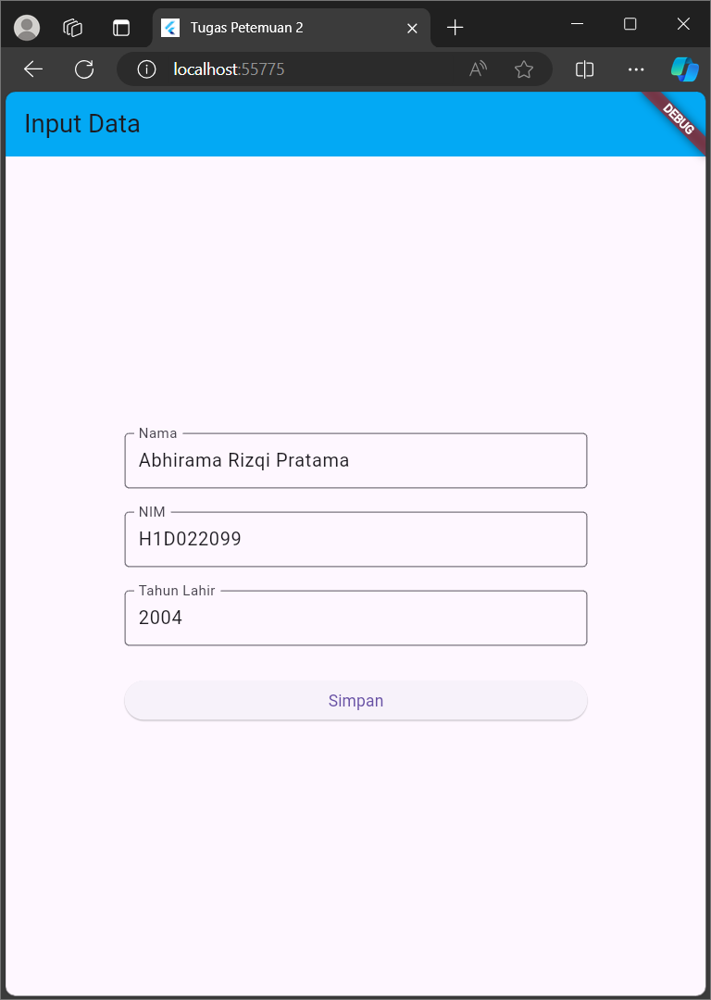
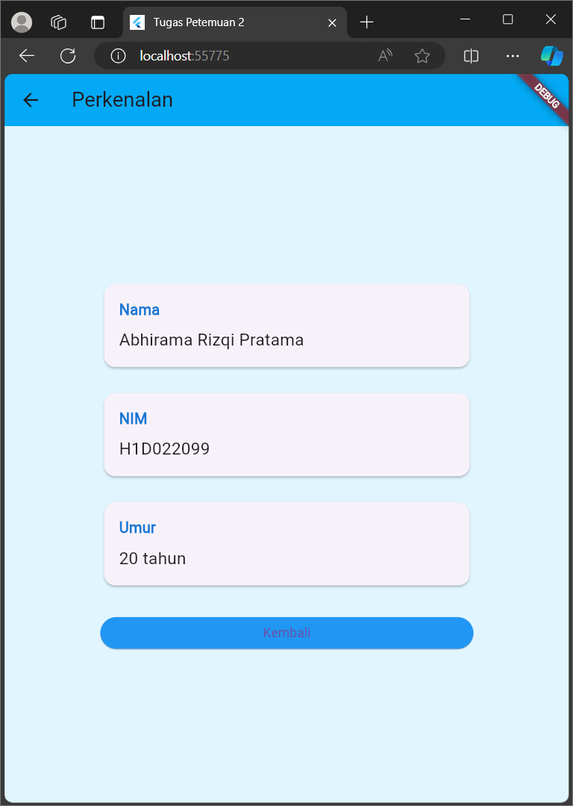

# Tugas Pertemuan 2
Nama : Abhirama Rizqi Pratama

NIM : H1D022099

Shift Baru: Shift A

## Proses Passing Data Dari Form Ke Tampilan

1. Pengumpulan Data di FormData
   Dalam widget from_data, menggunakan TextEditingController untuk setiap field input:
   class FormDataState extends State<FormData> {
   final _namaController = TextEditingController();
   final _nimController = TextEditingController();
   final _tahunController = TextEditingController();
   Ketika data diketikan, data disimpan dalam controller-controller ini.

2. Persiapan Data untuk Passing
   Saat tombol "Simpan" ditekan, kita mengambil nilai dari controller:
   onPressed: () {
   String nama = _namaController.text;
   String nim = _nimController.text;
   int tahun = int.parse(_tahunController.text);
   Navigator.of(context).push(MaterialPageRoute(
   builder: (context) => TampilData(nama: nama, nim: nim, tahun: tahun),
   ));
   },

3. Navigasi dan Passing Data
   Menggunakan Navigator untuk berpindah ke halaman tampil_data sambil meneruskan data
   Navigator.of(context).push(MaterialPageRoute(
   builder: (context) => TampilData(nama: nama, nim: nim, tahun: tahun),
   ));

4. Penerimaan Data di TampilData 
   kelas tampil_data digunakan untuk menerima data
   class TampilData extends StatelessWidget {
   final String nama;
   final String nim;
   final int tahun;
   const TampilData({
   Key? key,
   required this.nama,
   required this.nim,
   required this.tahun,
   }) : super(key: key);

5. Penggunaan Data pada TampilData
   Setelah data diterima, tampil_data menggunakannya untuk membuat tampilan
   final int umur = DateTime.now().year - tahun;
   _buildInfoCard("Nama", nama),
   _buildInfoCard("NIM", nim),
   _buildInfoCard("Umur", "$umur tahun"),
   pada kode diatas nama dan nim akan ditampilkan langsung, sementara tahun lahir digunakan untuk menghitung umur

## Screenshot

